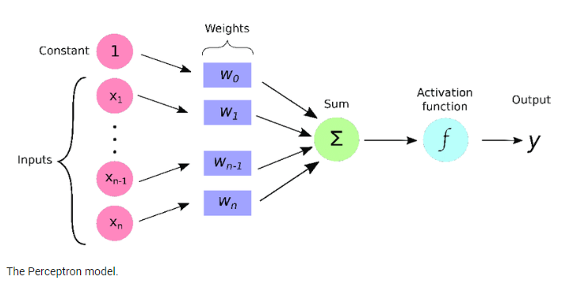

## Phần 1: Giới thiệu về Deep Learning - Lược sử và khái niệm

Deep Learning (học sâu), một nhánh của Machine Learning (học máy), đã và đang tạo nên những bước đột phá ngoạn mục trong lĩnh vực trí tuệ nhân tạo. Deep Learning mô phỏng cách thức hoạt động của não bộ con người, cho phép máy tính "học" từ dữ liệu và tự động trích xuất các đặc trưng phức tạp.

### 1.1 Deep Learning - Mô phỏng não bộ, khai phá dữ liệu

Deep Learning sử dụng các mạng nơ-ron nhân tạo (ANN) với nhiều lớp để phân tích dữ liệu. Mỗi nơ-ron nhân tạo là một đơn vị tính toán đơn giản, được kết nối với nhau tạo thành một mạng lưới phức tạp. Thông qua quá trình huấn luyện, mạng nơ-ron này sẽ "học" cách nhận biết các mẫu và quy luật trong dữ liệu.

**Các đặc điểm nổi bật của Deep Learning:**

* **Tự động trích xuất đặc trưng:** Khác với các phương pháp Machine Learning truyền thống, Deep Learning có khả năng tự động trích xuất các đặc trưng từ dữ liệu thô (hình ảnh, văn bản, âm thanh) mà không cần sự can thiệp của con người. Điều này giúp giảm thiểu công sức thiết kế đặc trưng thủ công, đồng thời cho phép mô hình học được những đặc trưng phức tạp mà con người khó nhận biết.

* **Kiến trúc mạng nhiều lớp:** Các mạng nơ-ron trong Deep Learning thường có nhiều lớp ẩn, cho phép mô hình học các đặc trưng ở nhiều mức độ trừu tượng khác nhau. Kiến trúc này mô phỏng cách thức hoạt động của não bộ, trong đó thông tin được xử lý qua nhiều tầng lớp nơ-ron để đưa ra quyết định.

* **Học biểu diễn dữ liệu:** Deep Learning có khả năng học các biểu diễn dữ liệu hiệu quả, tức là tìm ra cách biểu diễn dữ liệu dưới dạng phù hợp với từng bài toán cụ thể. Điều này giúp cải thiện đáng kể hiệu suất của các tác vụ Machine Learning.

### 1.2 Ứng dụng của Deep Learning - "Bàn tay ma thuật" trong mọi lĩnh vực

Deep Learning đang được ứng dụng rộng rãi trong hầu hết các lĩnh vực của đời sống, từ những ứng dụng quen thuộc như nhận dạng khuôn mặt trên điện thoại cho đến những ứng dụng phức tạp như chẩn đoán bệnh, lái xe tự động.

**Một số lĩnh vực ứng dụng tiêu biểu:**

* **Thị giác máy tính:** Nhận dạng hình ảnh, phát hiện đối tượng, phân đoạn ảnh, xử lý ảnh y tế, thị giác robot...
* **Xử lý ngôn ngữ tự nhiên:** Dịch máy, phân tích cảm xúc, tổng hợp tiếng nói, chatbot, tạo văn bản...
* **Âm thanh và giọng nói:** Nhận dạng giọng nói, tổng hợp giọng nói, phân loại âm thanh...
* **Y tế:** Chẩn đoán bệnh, phân tích hình ảnh y tế, phát hiện thuốc mới...
* **Tài chính:** Dự đoán thị trường, phát hiện gian lận...
* **Giao thông:** Xe tự lái, quản lý giao thông...
* **Khoa học:** Phân tích dữ liệu khoa học, khám phá khoa học...

### 1.3 Lịch sử phát triển - Hành trình từ ý tưởng đến hiện thực

Deep Learning đã trải qua một chặng đường dài phát triển, từ những ý tưởng sơ khai đến những thành tựu đột phá như hiện nay:

* **Những năm 1940s-1960s:** Ý tưởng về mạng nơ-ron nhân tạo ra đời, lấy cảm hứng từ hoạt động của não bộ.
* **Những năm 1980s-1990s:** Phát triển thuật toán Backpropagation, mạng nơ-ron nhiều lớp.
* **Những năm 2000s:** Deep Learning gặp nhiều khó khăn do hạn chế về dữ liệu và sức mạnh tính toán.
* **Những năm 2010s đến nay:** Deep Learning bùng nổ mạnh mẽ nhờ sự phát triển của Big Data, GPU, và các thuật toán mới.

### 1.4 Tại sao nên chọn Deep Learning? - "Chìa khóa vạn năng" cho trí tuệ nhân tạo

Deep Learning mang lại nhiều ưu điểm vượt trội so với các phương pháp Machine Learning truyền thống:

* **Hiệu suất vượt trội:** Deep Learning đạt được hiệu suất cao trong nhiều tác vụ, thậm chí vượt qua cả khả năng của con người trong một số lĩnh vực như nhận dạng hình ảnh.
* **Tự động trích xuất đặc trưng:** Giúp tiết kiệm thời gian và công sức, đồng thời cho phép mô hình học được những đặc trưng phức tạp.
* **Khả năng học biểu diễn dữ liệu:** Cải thiện hiệu suất bằng cách tìm ra cách biểu diễn dữ liệu phù hợp với từng bài toán.
* **Ứng dụng rộng rãi:** Deep Learning có thể được áp dụng trong hầu hết các lĩnh vực, giúp giải quyết những bài toán phức tạp mà trước đây con người chưa thể giải quyết được.

## Phần 2: Khái niệm cơ bản trong Deep Learning - Nền móng của mạng nơ-ron

Để xây dựng và huấn luyện các mô hình Deep Learning hiệu quả, việc nắm vững các khái niệm cơ bản là vô cùng quan trọng. Phần này sẽ giới thiệu những "viên gạch" nền tảng cấu thành mạng nơ-ron, từ nơ-ron, lớp, hàm kích hoạt, cho đến các quá trình lan truyền tiến và lan truyền ngược.


### 2.1 Perceptron: Mô hình nơ-ron đơn giản

Perceptron, được giới thiệu vào những năm 1950, là một trong những mô hình mạng nơ-ron đầu tiên và đơn giản nhất. Mặc dù có cấu trúc đơn giản, Perceptron đã đặt nền móng cho sự phát triển của các mạng nơ-ron phức tạp hơn và đóng vai trò quan trọng trong lịch sử phát triển của Trí tuệ nhân tạo.

Về cơ bản, Perceptron là một mô hình tuyến tính, nhận đầu vào là một vector các giá trị số và tạo ra đầu ra là một giá trị số duy nhất. Quá trình tính toán của Perceptron có thể được biểu diễn như sau:

1. **Tính tổng trọng số:** Mỗi đầu vào được nhân với một trọng số tương ứng, sau đó các giá trị này được cộng lại với một bias.
2. **Áp dụng hàm kích hoạt:** Kết quả của bước 1 được đưa qua một hàm kích hoạt (activation function) để tạo ra đầu ra.

Hàm kích hoạt thường là một hàm phi tuyến tính, ví dụ như hàm bước (step function) hoặc hàm sigmoid. Hàm kích hoạt giúp Perceptron có khả năng học các mẫu phi tuyến tính trong dữ liệu.

**Mô hình hóa Perceptron bằng Toán học**

Perceptron, một trong những mô hình mạng nơ-ron đầu tiên, có thể được biểu diễn bằng một hàm toán học đơn giản.  

Giả sử Perceptron có $n$ đầu vào, ký hiệu là  $x_1, x_2, ..., x_n$. Mỗi đầu vào  $x_i$  tương ứng với một trọng số  $w_i$, thể hiện mức độ ảnh hưởng của đầu vào đó đến kết quả. Ngoài ra, Perceptron còn có một bias $b$, đóng vai trò như một hằng số điều chỉnh.

Đầu ra $y$ của Perceptron được tính bằng cách lấy tổng trọng số các đầu vào cộng với bias, sau đó áp dụng một hàm kích hoạt $f$:

```
y = f(w_1 x_1 + w_2 x_2 + ... + w_n x_n + b)
```

Hàm kích hoạt $f$  đưa phi tuyến tính vào mô hình, cho phép Perceptron học các quy luật phức tạp hơn.  Một số hàm kích hoạt phổ biến bao gồm hàm bước (step function), hàm sigmoid, và hàm ReLU.

**Ví dụ:**

Xét một Perceptron với 2 đầu vào: $x_1 = 0.5$ và $x_2 = 0.3$, trọng số tương ứng là $w_1 = 0.8$ và $w_2 = 0.2$, bias $b = 0.1$, và hàm kích hoạt là hàm sigmoid.  Đầu ra của Perceptron sẽ được tính như sau:

```
y = sigmoid(0.8 * 0.5 + 0.2 * 0.3 + 0.1) = sigmoid(0.51) ≈ 0.624
```


### 2.2 Lớp (Layer) - Tổ chức các nơ-ron

Các nơ-ron được tổ chức thành các lớp (layer) để tạo thành mạng nơ-ron. Một mạng nơ-ron thường có ba loại lớp:

* **Lớp đầu vào (input layer):** Nhận dữ liệu đầu vào.
* **Lớp ẩn (hidden layer):** Thực hiện các phép biến đổi trên dữ liệu. Một mạng nơ-ron có thể có một hoặc nhiều lớp ẩn.
* **Lớp đầu ra (output layer):** Tạo ra kết quả dự đoán.

### 2.3 Hàm kích hoạt - "Thêm gia vị" cho mạng nơ-ron

Hàm kích hoạt (activation function) đóng vai trò quan trọng trong việc đưa phi tuyến tính vào mạng nơ-ron. Nếu không có hàm kích hoạt, mạng nơ-ron chỉ là một phép biến đổi tuyến tính, không thể học được các mẫu phức tạp trong dữ liệu.

**Một số hàm kích hoạt phổ biến:**

* **Sigmoid:** Biến đổi đầu vào thành giá trị trong khoảng (0, 1).
* **ReLU (Rectified Linear Unit):** Trả về giá trị đầu vào nếu nó dương, ngược lại trả về 0.
* **Tanh (Hyperbolic Tangent):** Biến đổi đầu vào thành giá trị trong khoảng (-1, 1).


### 2.4 Hàm mất mát - "Thước đo" hiệu quả

Hàm mất mát (loss function) đo lường mức độ sai khác giữa kết quả dự đoán của mô hình và kết quả thực tế. Mục tiêu của huấn luyện mô hình là giảm thiểu hàm mất mát.

**Một số hàm mất mát phổ biến:**

* **Mean Squared Error (MSE):** Thường dùng cho bài toán hồi quy.
* **Cross-entropy:** Thường dùng cho bài toán phân loại.

### 2.5 Lan truyền tiến và lan truyền ngược - "Hai bước nhảy" của mạng nơ-ron

**Lan truyền tiến (forward propagation):** Quá trình đưa dữ liệu vào mạng nơ-ron, tính toán đầu ra của từng lớp, và cuối cùng tạo ra kết quả dự đoán.

**Lan truyền ngược (backward propagation):** Quá trình tính toán gradient của hàm mất mát theo các trọng số, từ đó cập nhật trọng số để giảm thiểu sai số.

Hai quá trình này lặp đi lặp lại trong quá trình huấn luyện mô hình, giúp mô hình "học" từ dữ liệu và cải thiện khả năng dự đoán.


## Phần 3: PyTorch - Công cụ linh hoạt cho Deep Learning

### 3.1 PyTorch: Khái niệm và vai trò

PyTorch là một thư viện mã nguồn mở, được phát triển bởi Facebook AI Research (FAIR), cung cấp một nền tảng linh hoạt và hiệu quả cho việc xây dựng và huấn luyện các mô hình Deep Learning. PyTorch nổi bật với khả năng tính toán động, cho phép người dùng định nghĩa và sửa đổi mô hình một cách linh hoạt, ngay cả trong quá trình huấn luyện.

PyTorch được thiết kế với mục tiêu hỗ trợ tối đa cho việc nghiên cứu và thử nghiệm các ý tưởng mới trong Deep Learning. Tính linh hoạt của PyTorch cho phép người dùng dễ dàng điều chỉnh mô hình, thay đổi kiến trúc mạng, và thử nghiệm các thuật toán tối ưu hóa khác nhau mà không gặp phải những ràng buộc cứng nhắc.

### 3.2 Ưu điểm của PyTorch

* **Tính linh hoạt:** PyTorch cho phép người dùng định nghĩa và sửa đổi mô hình một cách linh hoạt, ngay cả trong quá trình huấn luyện. Điều này tạo điều kiện thuận lợi cho việc thử nghiệm các ý tưởng mới và nghiên cứu các kiến trúc mạng phức tạp.

    Ví dụ, để thêm một lớp fully connected vào mô hình, người dùng có thể sử dụng đoạn code sau:

    ```python
    import torch.nn as nn

    # Thêm một lớp fully connected với 10 đầu vào và 5 đầu ra
    model.add_module("fc3", nn.Linear(10, 5))
    ```

* **Dễ sử dụng:** PyTorch sử dụng Python, một ngôn ngữ lập trình phổ biến và dễ học. Cú pháp của PyTorch được thiết kế trực quan và dễ hiểu, giúp người dùng nhanh chóng làm quen và sử dụng.

    Ví dụ, để tạo một Tensor ngẫu nhiên với kích thước 3x4, người dùng có thể sử dụng đoạn code sau:

    ```python
    import torch

    # Tạo một Tensor ngẫu nhiên
    tensor = torch.rand(3, 4)
    ```

* **Hỗ trợ GPU:** PyTorch được tối ưu hóa để tận dụng sức mạnh tính toán của GPU, cho phép huấn luyện các mô hình Deep Learning với tốc độ nhanh hơn đáng kể so với việc chỉ sử dụng CPU.

    Ví dụ, để chuyển một Tensor sang GPU (nếu có), người dùng có thể sử dụng đoạn code sau:

    ```python
    import torch

    # Chuyển Tensor sang GPU
    if torch.cuda.is_available():
        tensor = tensor.cuda()
    ```

* **Cộng đồng lớn mạnh:** PyTorch có một cộng đồng người dùng và nhà phát triển đông đảo, luôn sẵn sàng hỗ trợ và chia sẻ kiến thức. Điều này giúp người dùng dễ dàng tìm kiếm tài liệu, hướng dẫn, và giải đáp các thắc mắc trong quá trình sử dụng PyTorch.

### 3.3 Cài đặt PyTorch

Việc cài đặt PyTorch khá đơn giản. Người dùng có thể sử dụng `pip` (trình quản lý gói của Python) để cài đặt PyTorch và các thư viện liên quan:

```bash
pip install torch torchvision torchaudio
```

### 3.4 Các thành phần cơ bản trong PyTorch

* **Tensor:** Tensor là cấu trúc dữ liệu cơ bản trong PyTorch, tương tự như mảng nhiều chiều trong NumPy. Tensor cho phép lưu trữ và xử lý dữ liệu số học trên GPU, giúp tăng tốc độ tính toán.

* **Autograd:** Autograd là hệ thống tính toán gradient tự động trong PyTorch. Autograd giúp tính toán đạo hàm của các hàm phức tạp một cách dễ dàng, đóng vai trò quan trọng trong việc huấn luyện các mô hình Deep Learning.

* **`nn.Module`:** `nn.Module` là lớp cơ sở để xây dựng các khối (block) trong mạng nơ-ron. PyTorch cung cấp sẵn nhiều lớp `nn.Module` như `nn.Linear`, `nn.Conv2d`, `nn.RNN`... Người dùng có thể kế thừa lớp `nn.Module` để tạo các lớp tùy chỉnh cho mô hình của mình.

## Phần 4: Tensor - Khối xây dựng nền tảng trong PyTorch

### 4.1 Tensor: Biểu diễn dữ liệu đa chiều

Tensor là một cấu trúc dữ liệu trung tâm trong PyTorch, đóng vai trò then chốt trong việc biểu diễn và xử lý dữ liệu. Về bản chất, Tensor là một mảng đa chiều, có khả năng chứa đựng dữ liệu số học với nhiều kiểu dữ liệu khác nhau (số nguyên, số thực, boolean...). Tensor có thể được xem là sự tổng quát hóa của ma trận và vector:

* **Scalar:** Một Tensor 0 chiều, biểu diễn một giá trị đơn lẻ.
* **Vector:** Một Tensor 1 chiều, biểu diễn một dãy các giá trị.
* **Ma trận:** Một Tensor 2 chiều, biểu diễn một bảng các giá trị.
* **Tensor n chiều (n > 2):** Biểu diễn dữ liệu với nhiều chiều hơn, thường được sử dụng trong các ứng dụng như xử lý ảnh (3 chiều cho ảnh màu), xử lý video (4 chiều), hoặc xử lý dữ liệu chuỗi thời gian.

### 4.2 Các phép toán trên Tensor

PyTorch cung cấp một bộ công cụ phong phú cho phép thực hiện các phép toán trên Tensor, bao gồm:

* **Phép toán số học:** Các phép toán cơ bản như cộng, trừ, nhân, chia, lũy thừa... được thực hiện trên từng phần tử của Tensor.
* **Phép toán ma trận:** Các phép toán như nhân ma trận, chuyển vị, tính định thức... được hỗ trợ đầy đủ.
* **Phép toán so sánh:** Các phép toán so sánh như lớn hơn, nhỏ hơn, bằng... được thực hiện trên từng phần tử của Tensor.
* **Phép toán logic:** Các phép toán logic như AND, OR, NOT... được thực hiện trên từng phần tử của Tensor.

**Ví dụ minh họa:**

```python
import torch

# Khởi tạo hai Tensor
a = torch.tensor([[1, 2], [3, 4]])
b = torch.tensor([[5, 6], [7, 8]])

# Phép cộng
c = a + b  # c = [[6, 8], [10, 12]]

# Phép nhân ma trận
d = a @ b  # d = [[19, 22], [43, 50]]

# Phép so sánh
e = a > b  # e = [[False, False], [False, False]]
```

### 4.3 Tạo và biến đổi Tensor

PyTorch cung cấp nhiều phương thức để tạo và biến đổi Tensor, giúp người dùng linh hoạt trong việc xử lý dữ liệu:

* **Tạo Tensor từ list hoặc array:**

```python
import torch

# Tạo Tensor từ list
a = torch.tensor([1, 2, 3])

# Tạo Tensor từ NumPy array
import numpy as np
arr = np.array([4, 5, 6])
b = torch.from_numpy(arr)
```

* **Tạo Tensor với giá trị ngẫu nhiên:**

```python
import torch

# Tạo Tensor với giá trị ngẫu nhiên từ phân phối đều (0, 1)
a = torch.rand(3, 4)  # Tensor 3x4

# Tạo Tensor với giá trị ngẫu nhiên từ phân phối chuẩn
b = torch.randn(2, 5)  # Tensor 2x5
```

* **Thay đổi kích thước Tensor:**

```python
import torch

a = torch.tensor([[1, 2, 3], [4, 5, 6]])  # Tensor 2x3

# Thay đổi kích thước thành 3x2
b = a.view(3, 2)
```

* **Ghép các Tensor:**

```python
import torch

a = torch.tensor([[1, 2], [3, 4]])
b = torch.tensor([[5, 6], [7, 8]])

# Ghép theo chiều dọc (dim=0)
c = torch.cat((a, b), dim=0)  # c = [[1, 2], [3, 4], [5, 6], [7, 8]]

# Ghép theo chiều ngang (dim=1)
d = torch.cat((a, b), dim=1)  # d = [[1, 2, 5, 6], [3, 4, 7, 8]]
```

* **Chuyển đổi kiểu dữ liệu:**

```python
import torch

a = torch.tensor([1, 2, 3])  # Kiểu dữ liệu mặc định là int64

# Chuyển sang kiểu float32
b = a.float()
```

### 4.4 Tensor và GPU

Một trong những ưu điểm quan trọng của PyTorch là khả năng tận dụng sức mạnh tính toán của GPU. Các phép toán trên Tensor có thể được thực hiện trên GPU, giúp tăng tốc độ xử lý đáng kể.

**Chuyển Tensor sang GPU:**

```python
import torch

# Kiểm tra xem GPU có sẵn hay không
if torch.cuda.is_available():
  device = torch.device('cuda')
else:
  device = torch.device('cpu')

# Tạo Tensor trên GPU
a = torch.rand(3, 4, device=device)
```

Tensor là nền tảng cho việc xây dựng và huấn luyện các mô hình Deep Learning trong PyTorch. Việc nắm vững các thao tác trên Tensor là bước khởi đầu quan trọng để thành thạo PyTorch và Deep Learning.

## Phần 5: Xây dựng mạng nơ-ron đầu tiên - Perceptron và những khái niệm nền tảng

### 5.1 Perceptron: Mô hình nơ-ron đơn giản

Perceptron, được giới thiệu vào những năm 1950, là một trong những mô hình mạng nơ-ron đầu tiên và đơn giản nhất. Mặc dù có cấu trúc đơn giản, Perceptron đã đặt nền móng cho sự phát triển của các mạng nơ-ron phức tạp hơn và đóng vai trò quan trọng trong lịch sử phát triển của Trí tuệ nhân tạo.

Về cơ bản, Perceptron là một mô hình tuyến tính, nhận đầu vào là một vector các giá trị số và tạo ra đầu ra là một giá trị số duy nhất. Quá trình tính toán của Perceptron có thể được biểu diễn như sau:

1. **Tính tổng trọng số:** Mỗi đầu vào được nhân với một trọng số tương ứng, sau đó các giá trị này được cộng lại với một bias.
2. **Áp dụng hàm kích hoạt:** Kết quả của bước 1 được đưa qua một hàm kích hoạt (activation function) để tạo ra đầu ra.

Hàm kích hoạt thường là một hàm phi tuyến tính, ví dụ như hàm bước (step function) hoặc hàm sigmoid. Hàm kích hoạt giúp Perceptron có khả năng học các mẫu phi tuyến tính trong dữ liệu.


### Mô hình Toán học của Perceptron

Perceptron, một dạng mạng nơ-ron cơ bản, có thể được biểu diễn bằng một hàm toán học.  

Xét một Perceptron với $n$ đầu vào, ký hiệu là $x_1, x_2, ..., x_n$, mỗi đầu vào $x_i$  có trọng số tương ứng $w_i$,  thể hiện mức độ ảnh hưởng của  $x_i$ đến kết quả. Perceptron cũng bao gồm một bias $b$,  hoạt động như một hằng số điều chỉnh.

Đầu ra $y$ của Perceptron được tính bằng cách  tổng hợp trọng số của các đầu vào với bias, sau đó áp dụng hàm kích hoạt $f$:

$$
y = f(\sum_{i=1}^{n} w_i x_i + b)
$$

Hàm kích hoạt $f$  đưa phi tuyến tính vào mô hình, cho phép Perceptron học các quy luật phức tạp. Các hàm kích hoạt thường gặp bao gồm hàm bước (step function), hàm sigmoid, hàm ReLU...


**Ví dụ:**

Với Perceptron có 2 đầu vào: $x_1 = 0.5$ và $x_2 = 0.3$, trọng số $w_1 = 0.8$ và $w_2 = 0.2$, bias $b = 0.1$, và hàm kích hoạt sigmoid, đầu ra  $y$ được tính như sau:

```
y = sigmoid(0.8 * 0.5 + 0.2 * 0.3 + 0.1) = sigmoid(0.51) ≈ 0.624 
```

**Lưu ý:** Ký hiệu $\sum_{i=1}^{n} w_i x_i$  trong công thức trên là cách viết gọn của tổng  $w_1 x_1 + w_2 x_2 + ... + w_n x_n$.


### 5.2 Xây dựng Perceptron với PyTorch

PyTorch cung cấp các công cụ để xây dựng Perceptron một cách dễ dàng. Lớp `torch.nn.Linear` thực hiện phép biến đổi tuyến tính, tương đương với việc tính tổng trọng số đầu vào và bias.

**Ví dụ minh họa:**

```python
import torch.nn as nn

# Định nghĩa lớp Perceptron
class Perceptron(nn.Module):
    def __init__(self, input_size, output_size):
        super(Perceptron, self).__init__()
        self.linear = nn.Linear(input_size, output_size)

    def forward(self, x):
        output = self.linear(x)
        return output

# Khởi tạo một Perceptron với 3 đầu vào và 1 đầu ra
perceptron = Perceptron(3, 1)
```

### 5.3 Hàm kích hoạt và hàm mất mát

* **Hàm kích hoạt:** Sau khi tính toán đầu ra của lớp `torch.nn.Linear`, chúng ta có thể áp dụng một hàm kích hoạt. Ví dụ, để sử dụng hàm sigmoid, ta có thể sử dụng `torch.sigmoid()`.

* **Hàm mất mát:** Hàm mất mát được sử dụng để đo lường mức độ sai khác giữa đầu ra dự đoán của mô hình và giá trị thực tế. PyTorch cung cấp nhiều hàm mất mát khác nhau, ví dụ như `nn.MSELoss()` (cho bài toán hồi quy) và `nn.CrossEntropyLoss()` (cho bài toán phân loại).

### 5.4 Huấn luyện mô hình

Quá trình huấn luyện mô hình bao gồm các bước sau:

1. **Lan truyền tiến (forward propagation):** Đưa dữ liệu vào mô hình và tính toán đầu ra.
2. **Tính toán hàm mất mát:** So sánh đầu ra của mô hình với giá trị thực tế.
3. **Lan truyền ngược (backward propagation):** Tính toán gradient của hàm mất mát theo các trọng số.
4. **Cập nhật trọng số:** Sử dụng thuật toán tối ưu hóa (optimizer) để cập nhật trọng số, giảm thiểu hàm mất mát.

**Ví dụ minh họa:**

```python
import torch
import torch.nn as nn
import torch.optim as optim

# Khởi tạo mô hình, hàm mất mát, và optimizer
model = Perceptron(3, 1)
criterion = nn.MSELoss()
optimizer = optim.SGD(model.parameters(), lr=0.01)

# Dữ liệu huấn luyện (ví dụ)
inputs = torch.tensor([[0.5, 0.3, 0.2], [0.8, 0.1, 0.9]])
targets = torch.tensor([[0.7], [0.3]])

# Huấn luyện mô hình
for epoch in range(100):
    # Lan truyền tiến
    outputs = model(inputs)
    loss = criterion(outputs, targets)

    # Lan truyền ngược và cập nhật trọng số
    optimizer.zero_grad()
    loss.backward()
    optimizer.step()

    # In giá trị mất mát sau mỗi epoch
    print(f'Epoch [{epoch+1}/100], Loss: {loss.item():.4f}')
```

Perceptron là một mô hình đơn giản nhưng quan trọng trong Deep Learning. Nó là nền tảng để xây dựng các mạng nơ-ron phức tạp hơn, giúp giải quyết các bài toán đa dạng trong nhiều lĩnh vực.

## Phần 6: Kiến trúc mạng nơ-ron nâng cao - Mở rộng khả năng của Deep Learning

Sau khi đã nắm vững những khái niệm cơ bản và làm quen với Perceptron, chúng ta sẽ tiếp tục hành trình khám phá Deep Learning với những kiến trúc mạng nơ-ron phức tạp và mạnh mẽ hơn. Các kiến trúc này được thiết kế để giải quyết những bài toán phức tạp, đòi hỏi khả năng xử lý thông tin ở mức độ cao hơn.

### 6.1 Convolutional Neural Networks (CNNs) - "Chuyên gia" xử lý hình ảnh

Convolutional Neural Networks (CNNs) là một loại mạng nơ-ron được thiết kế đặc biệt để xử lý dữ liệu có cấu trúc không gian, chẳng hạn như hình ảnh. CNNs có khả năng tự động học và trích xuất các đặc trưng từ hình ảnh, giúp cho việc phân loại, nhận dạng, và phân tích hình ảnh trở nên hiệu quả hơn.

**Cấu trúc của CNNs:**

CNNs thường bao gồm các lớp sau:

* **Lớp Convolutional (Convolutional Layer):** Thực hiện phép tích chập (convolution) trên đầu vào, trích xuất các đặc trưng cục bộ.
* **Lớp Pooling (Pooling Layer):** Giảm kích thước của feature map, giúp giảm số lượng tham số và tăng tính bất biến của mô hình.
* **Lớp Fully Connected (Fully Connected Layer):** Kết nối tất cả các nơ-ron từ lớp trước đó, thường được sử dụng ở cuối mạng để đưa ra dự đoán.


**Ví dụ minh họa:**

```python
import torch.nn as nn

class CNN(nn.Module):
    def __init__(self):
        super(CNN, self).__init__()
        self.conv1 = nn.Conv2d(1, 16, kernel_size=3, padding=1)
        self.pool = nn.MaxPool2d(2, 2)
        self.conv2 = nn.Conv2d(16, 32, kernel_size=3, padding=1)
        self.fc1 = nn.Linear(32 * 7 * 7, 120)
        self.fc2 = nn.Linear(120, 84)
        self.fc3 = nn.Linear(84, 10)

    def forward(self, x):
        x = self.pool(F.relu(self.conv1(x)))
        x = self.pool(F.relu(self.conv2(x)))
        x = x.view(-1, 32 * 7 * 7)
        x = F.relu(self.fc1(x))
        x = F.relu(self.fc2(x))
        x = self.fc3(x)
        return x
```

### 6.2 Recurrent Neural Networks (RNNs) - "Bậc thầy" xử lý dữ liệu chuỗi

Recurrent Neural Networks (RNNs) là một loại mạng nơ-ron được thiết kế để xử lý dữ liệu chuỗi, chẳng hạn như văn bản, tín hiệu thời gian. RNNs có khả năng "ghi nhớ" thông tin từ các bước thời gian trước đó, giúp cho việc xử lý dữ liệu chuỗi trở nên hiệu quả hơn.

**Cấu trúc của RNNs:**

RNNs có cấu trúc đặc biệt với các kết nối "vòng lặp", cho phép thông tin từ các bước thời gian trước đó ảnh hưởng đến kết quả ở bước thời gian hiện tại.

**Ví dụ minh họa:**

```python
import torch.nn as nn

class RNN(nn.Module):
    def __init__(self, input_size, hidden_size, output_size):
        super(RNN, self).__init__()
        self.hidden_size = hidden_size
        self.rnn = nn.RNN(input_size, hidden_size, batch_first=True)
        self.fc = nn.Linear(hidden_size, output_size)

    def forward(self, x):
        # Khởi tạo hidden state ban đầu
        h0 = torch.zeros(1, x.size(0), self.hidden_size) 
        
        # Lan truyền qua RNN
        out, _ = self.rnn(x, h0) 
        
        # Lấy output ở bước thời gian cuối cùng
        out = self.fc(out[:, -1, :]) 
        return out
```

### 6.3 Các kiến trúc mạng nơ-ron khác

Ngoài CNNs và RNNs, còn có nhiều kiến trúc mạng nơ-ron khác được sử dụng trong Deep Learning, ví dụ như:

* **Autoencoders:** Dùng để học biểu diễn dữ liệu nén.
* **Generative Adversarial Networks (GANs):** Dùng để tạo ra dữ liệu mới.
* **Transformers:** Dùng để xử lý dữ liệu chuỗi, đặc biệt là trong lĩnh vực xử lý ngôn ngữ tự nhiên.

Mỗi kiến trúc mạng nơ-ron có những ưu điểm và nhược điểm riêng, phù hợp với những bài toán cụ thể. Việc lựa chọn kiến trúc mạng phù hợp là một bước quan trọng trong việc xây dựng mô hình Deep Learning hiệu quả.

## Phần 7: Các phương pháp tối ưu hóa trong Deep Learning

Trong lĩnh vực Deep Learning, việc huấn luyện một mô hình hiệu quả đòi hỏi việc tìm kiếm bộ trọng số tối ưu để giảm thiểu hàm mất mát. Quá trình này có thể được ví như việc điều chỉnh các tham số của một hệ thống phức tạp để đạt được hiệu suất mong muốn. Các phương pháp tối ưu hóa đóng vai trò then chốt trong việc điều chỉnh các trọng số này, hướng dẫn mô hình "học" từ dữ liệu và cải thiện khả năng dự đoán.

### 7.1 Gradient Descent - Nguyên lý cơ bản

Gradient Descent là một thuật toán tối ưu hóa lặp đi lặp lại, được sử dụng rộng rãi trong huấn luyện các mô hình Deep Learning. Nguyên lý hoạt động của Gradient Descent dựa trên việc cập nhật các trọng số của mô hình theo hướng ngược với gradient của hàm mất mát. Gradient có thể được hiểu là vector chỉ hướng thay đổi lớn nhất của hàm số tại một điểm. Do đó, di chuyển ngược hướng gradient sẽ giúp giảm thiểu giá trị hàm mất mát một cách hiệu quả.

Quá trình này có thể được hình dung như sau:

1. **Khởi tạo:** Bắt đầu với một bộ trọng số ngẫu nhiên.
2. **Tính toán gradient:** Tính toán gradient của hàm mất mát tại điểm đại diện bởi bộ trọng số hiện tại.
3. **Cập nhật trọng số:** Cập nhật trọng số bằng cách trừ đi một phần nhỏ của gradient (nhân với tốc độ học - learning rate).
4. **Lặp lại:** Lặp lại bước 2 và 3 cho đến khi đạt được điều kiện dừng (ví dụ: số lần lặp tối đa, hàm mất mát đạt giá trị đủ nhỏ).

Tốc độ học (learning rate) là một siêu tham số quan trọng, quyết định "bước nhảy" của mỗi lần cập nhật trọng số. Lựa chọn tốc độ học phù hợp là rất quan trọng để đảm bảo thuật toán hội tụ hiệu quả.

**Minh họa bằng Python:**

```python
import torch

# Hàm f(x) = x^2 + 2x + 1
def f(x):
  return x**2 + 2*x + 1

# Đạo hàm của f(x)
def df(x):
  return 2*x + 2

# Khởi tạo giá trị x ban đầu
x = torch.tensor(5.0, requires_grad=True)

# Tốc độ học (learning rate)
learning_rate = 0.1

# Thực hiện Gradient Descent
for i in range(100):
  # Tính giá trị hàm f(x)
  y = f(x)

  # Tính gradient
  y.backward()

  # Cập nhật x theo hướng ngược với gradient
  with torch.no_grad():
    x -= learning_rate * x.grad

  # Reset gradient
  x.grad.zero_()

  # In giá trị x và f(x) sau mỗi bước
  print(f"Bước {i+1}: x = {x.item():.4f}, f(x) = {y.item():.4f}")
```

### 7.2 Các biến thể của Gradient Descent

Gradient Descent có nhiều biến thể, được phát triển để khắc phục những hạn chế của thuật toán gốc và tăng tốc độ huấn luyện:

* **Stochastic Gradient Descent (SGD):** Thay vì tính toán gradient trên toàn bộ tập dữ liệu huấn luyện, SGD tính toán gradient trên một "mini-batch" (nhóm nhỏ) dữ liệu. Điều này giúp tăng tốc độ huấn luyện, đặc biệt là khi tập dữ liệu rất lớn. Tuy nhiên, SGD có thể dao động mạnh trong quá trình huấn luyện do tính ngẫu nhiên của việc chọn mini-batch.

* **Adam (Adaptive Moment Estimation):** Adam là một thuật toán tối ưu hóa kết hợp các ưu điểm của Momentum và RMSprop. Momentum giúp thuật toán "duy trì đà" và vượt qua các điểm cực tiểu cục bộ. RMSprop điều chỉnh tốc độ học cho từng tham số, giúp thuật toán hội tụ nhanh hơn. Adam thường được sử dụng rộng rãi do hiệu suất tốt trên nhiều bài toán khác nhau.

* **RMSprop (Root Mean Square Propagation):** RMSprop điều chỉnh tốc độ học cho từng tham số dựa trên bình phương trung bình của gradient. Điều này giúp thuật toán hội tụ nhanh hơn, đặc biệt là trong những trường hợp hàm mất mát có độ cong lớn.

### 7.3 Lựa chọn phương pháp tối ưu hóa

Việc lựa chọn phương pháp tối ưu hóa phù hợp phụ thuộc vào nhiều yếu tố, bao gồm:

* **Đặc điểm của tập dữ liệu:** Kích thước, độ phức tạp, phân bố dữ liệu.
* **Kiến trúc mạng nơ-ron:** Độ sâu, số lượng tham số, loại lớp.
* **Mục tiêu huấn luyện:** Tốc độ huấn luyện, độ chính xác, khả năng khái quát hóa.

Trong thực tế, Adam thường là lựa chọn phổ biến do hiệu suất tốt trên nhiều bài toán. Tuy nhiên, việc thử nghiệm với các phương pháp khác nhau và điều chỉnh siêu tham số là cần thiết để đạt được kết quả tối ưu.

## Phần 8: Các kỹ thuật chính quy hóa (Regularization) - "Kiểm soát" sức mạnh của mô hình

Trong huấn luyện mô hình Deep Learning, mục tiêu của chúng ta là tạo ra một mô hình có khả năng khái quát hóa tốt, tức là hoạt động hiệu quả trên dữ liệu mới, chưa từng gặp trong quá trình huấn luyện. Tuy nhiên, đôi khi mô hình lại "học quá kỹ" trên tập dữ liệu huấn luyện, đến mức "ghi nhớ" cả những nhiễu và chi tiết không quan trọng. Hiện tượng này được gọi là **overfitting**, khiến cho mô hình hoạt động kém hiệu quả trên dữ liệu mới.

Chính quy hóa (Regularization) là một tập hợp các kỹ thuật được sử dụng để ngăn chặn overfitting, giúp mô hình "học" những đặc trưng tổng quát hơn, từ đó cải thiện khả năng khái quát hóa.

### 8.1 Dropout - "Tắt ngẫu nhiên" các nơ-ron

Dropout là một kỹ thuật chính quy hóa đơn giản nhưng hiệu quả. Trong quá trình huấn luyện, Dropout ngẫu nhiên "tắt" một số nơ-ron, tức là không cho phép chúng tham gia vào quá trình lan truyền tiến và lan truyền ngược. Điều này buộc mô hình phải học các đặc trưng từ nhiều nơ-ron khác nhau, tránh phụ thuộc quá nhiều vào một số nơ-ron cụ thể.

**Minh họa bằng Python:**

```python
import torch.nn as nn

# Tạo một lớp Linear với Dropout
linear_layer = nn.Linear(10, 5)
dropout_layer = nn.Dropout(p=0.5)  # Xác suất Dropout là 0.5

# Trong quá trình huấn luyện:
output = linear_layer(input)
output = dropout_layer(output)  # Áp dụng Dropout
```

Trong đoạn code trên, `nn.Dropout(p=0.5)` sẽ ngẫu nhiên "tắt" 50% các nơ-ron trong lớp `linear_layer`.

### 8.2 L1/L2 Regularization - "Phạt" các trọng số lớn

L1/L2 Regularization thêm một thành phần vào hàm mất mát, "phạt" các trọng số có giá trị lớn. Điều này khuyến khích mô hình sử dụng nhiều trọng số nhỏ thay vì một số trọng số lớn, giúp giảm độ phức tạp của mô hình và ngăn chặn overfitting.

* **L1 Regularization:** Thêm tổng giá trị tuyệt đối của các trọng số vào hàm mất mát.
* **L2 Regularization:** Thêm tổng bình phương của các trọng số vào hàm mất mát.

**Minh họa bằng Python:**

```python
import torch.nn as nn
import torch.optim as optim

# Khởi tạo mô hình và optimizer
model = MyModel()
optimizer = optim.SGD(model.parameters(), lr=0.01, weight_decay=1e-5)  # weight_decay là hệ số L2 regularization
```

Trong đoạn code trên, `weight_decay=1e-5` sẽ thêm thành phần L2 regularization vào hàm mất mát khi sử dụng optimizer `optim.SGD`.

### 8.3 Ứng dụng chính quy hóa

Chính quy hóa được sử dụng rộng rãi trong Deep Learning để cải thiện hiệu suất của mô hình, đặc biệt là khi:

* **Tập dữ liệu huấn luyện nhỏ:** Khi dữ liệu huấn luyện ít, mô hình dễ bị overfitting. Chính quy hóa giúp mô hình khái quát hóa tốt hơn trên dữ liệu mới.
* **Mô hình phức tạp:** Mô hình có nhiều tham số dễ bị overfitting. Chính quy hóa giúp giảm độ phức tạp của mô hình.

Việc lựa chọn kỹ thuật chính quy hóa phù hợp phụ thuộc vào đặc điểm của bài toán và tập dữ liệu. Thử nghiệm với các kỹ thuật khác nhau và điều chỉnh siêu tham số là cần thiết để đạt được hiệu quả tốt nhất.

## Phần 9: Các vấn đề thường gặp và cách giải quyết - "Bác sĩ" cho mạng nơ-ron

Trong quá trình huấn luyện mô hình Deep Learning, chúng ta thường gặp phải những "trục trặc" khiến cho mô hình hoạt động không như mong muốn. Những vấn đề này có thể được ví như những "căn bệnh" mà mạng nơ-ron mắc phải. Và để "chữa trị" cho những "căn bệnh" này, chúng ta cần đến những "bác sĩ" tài ba - đó chính là những kỹ thuật và phương pháp được thiết kế để giải quyết các vấn đề thường gặp trong Deep Learning.

Phần này sẽ "khám phá" những "căn bệnh" phổ biến nhất và đưa ra những "phương thuốc" hiệu quả để giúp mạng nơ-ron của bạn "khỏe mạnh" và hoạt động tốt nhất.

### 9.1 Vanishing Gradient - "Tín hiệu yếu dần"

Vanishing Gradient là một vấn đề xảy ra khi gradient của hàm mất mát trở nên rất nhỏ khi lan truyền ngược qua nhiều lớp. Điều này khiến cho việc cập nhật trọng số ở các lớp đầu trở nên khó khăn, làm chậm quá trình huấn luyện, thậm chí khiến cho mô hình không thể học được.

Hãy tưởng tượng gradient như một "tín hiệu" được gửi từ lớp đầu ra về lớp đầu vào. Khi "tín hiệu" này đi qua nhiều lớp, nó sẽ "yếu dần" và cuối cùng "biến mất", khiến cho các lớp đầu không nhận được "thông tin" để cập nhật trọng số.

**Nguyên nhân:**

* **Sử dụng các hàm kích hoạt "bão hòa":** Các hàm kích hoạt như sigmoid và tanh có vùng "bão hòa", nơi đạo hàm rất nhỏ. Khi gradient đi qua nhiều lớp với các hàm kích hoạt này, nó sẽ bị "nhân nhỏ" liên tục và "biến mất".

**Giải pháp:**

* **Sử dụng các hàm kích hoạt ReLU:** ReLU (Rectified Linear Unit) và các biến thể của nó (Leaky ReLU, Parametric ReLU) không có vùng "bão hòa", giúp giảm thiểu vanishing gradient.
* **Sử dụng các kiến trúc mạng ResNet:** ResNet (Residual Network) sử dụng các "đường tắt" (shortcut connection) để cho phép gradient lan truyền trực tiếp qua các lớp, tránh bị "yếu dần".

### 9.2 Exploding Gradient - "Tín hiệu bùng nổ"

Exploding Gradient là một vấn đề ngược lại với Vanishing Gradient, xảy ra khi gradient trở nên rất lớn khi lan truyền ngược. Điều này có thể khiến cho quá trình huấn luyện không ổn định, trọng số bị cập nhật quá mạnh và "phát nổ" (NaN - Not a Number).

**Nguyên nhân:**

* **Tốc độ học quá lớn:** Khi tốc độ học quá lớn, trọng số sẽ được cập nhật quá mạnh, dẫn đến exploding gradient.
* **Khởi tạo trọng số không phù hợp:** Nếu trọng số ban đầu quá lớn, gradient cũng có thể trở nên lớn.

**Giải pháp:**

* **Giảm tốc độ học:** Điều chỉnh tốc độ học nhỏ hơn để kiểm soát "bước nhảy" của mỗi lần cập nhật trọng số.
* **Sử dụng Gradient Clipping:** Giới hạn giá trị của gradient, ngăn chặn gradient trở nên quá lớn.

    ```python
    import torch.nn as nn

    # ...
    
    # Cập nhật trọng số
    nn.utils.clip_grad_norm_(model.parameters(), max_norm=1)  # Giới hạn norm của gradient <= 1
    optimizer.step()
    ```

### 9.3 Overfitting - "Học vẹt"

Overfitting xảy ra khi mô hình "học quá kỹ" trên tập dữ liệu huấn luyện, đến mức "ghi nhớ" cả những nhiễu và chi tiết không quan trọng, dẫn đến hoạt động kém hiệu quả trên dữ liệu mới.

**Nguyên nhân:**

* **Mô hình quá phức tạp:** Mô hình có quá nhiều tham số so với lượng dữ liệu huấn luyện.
* **Dữ liệu huấn luyện ít:** Không đủ dữ liệu để mô hình học được những đặc trưng tổng quát.

**Giải pháp:**

* **Sử dụng các kỹ thuật chính quy hóa:** Dropout, L1/L2 regularization...
* **Tăng kích thước tập dữ liệu huấn luyện:** Thu thập thêm dữ liệu hoặc sử dụng Data Augmentation (tạo ra các biến thể của dữ liệu huấn luyện).
* **Giảm độ phức tạp của mô hình:** Sử dụng ít lớp hoặc ít nơ-ron hơn.

### 9.4 Underfitting - "Học chưa tới"

Underfitting xảy ra khi mô hình quá đơn giản để học được những đặc trưng phức tạp trong dữ liệu.

**Nguyên nhân:**

* **Mô hình quá đơn giản:** Không đủ khả năng để biểu diễn dữ liệu.
* **Huấn luyện chưa đủ:** Số lần lặp (epochs) quá ít.

**Giải pháp:**

* **Tăng độ phức tạp của mô hình:** Thêm nhiều lớp hoặc nhiều nơ-ron hơn.
* **Huấn luyện lâu hơn:** Tăng số lần lặp (epochs).
* **Sử dụng các kỹ thuật tối ưu hóa hiệu quả hơn:** Adam, RMSprop...


## Phần 10: Xây dựng dự án Deep Learning - "Vũ khí" chinh phục thế giới thực

Sau khi đã trang bị đầy đủ "kiến thức võ công" về Deep Learning và PyTorch, giờ là lúc chúng ta bước vào "giang hồ" và sử dụng "vũ khí" này để chinh phục những thử thách thực tế. Phần này sẽ hướng dẫn bạn xây dựng một số dự án Deep Learning phổ biến, sử dụng PyTorch để giải quyết các bài toán trong các lĩnh vực khác nhau.

### 10.1 Phân loại ảnh - "Nhìn" và "hiểu" thế giới

Phân loại ảnh là một trong những ứng dụng phổ biến nhất của Deep Learning, với mục tiêu "dạy" cho máy tính khả năng "nhìn" và "hiểu" hình ảnh giống như con người. Các ứng dụng của phân loại ảnh rất đa dạng, từ nhận dạng khuôn mặt, phân loại các loại hoa, cho đến chẩn đoán bệnh từ hình ảnh y tế.

**Các bước thực hiện:**

1. **Chuẩn bị dữ liệu:**
    * Thu thập dữ liệu ảnh: Tìm kiếm và tải xuống các bộ dữ liệu ảnh có sẵn (CIFAR-10, ImageNet...) hoặc tự xây dựng bộ dữ liệu của riêng bạn.
    * Xử lý dữ liệu: Chuyển đổi ảnh sang định dạng phù hợp với PyTorch (Tensor), chuẩn hóa dữ liệu (ví dụ: chia cho 255 để đưa giá trị pixel về khoảng [0, 1]), chia dữ liệu thành tập huấn luyện, tập validation, và tập kiểm tra.

2. **Xây dựng mô hình CNNs:**
    * Lựa chọn kiến trúc mạng: Sử dụng các kiến trúc CNNs phổ biến (VGG, ResNet, Inception...) hoặc tự thiết kế kiến trúc mạng của riêng bạn.
    * Xây dựng mô hình bằng PyTorch: Sử dụng các lớp `torch.nn.Conv2d`, `torch.nn.MaxPool2d`, `torch.nn.Linear`... để xây dựng mô hình.

3. **Huấn luyện mô hình:**
    * Định nghĩa hàm mất mát và optimizer: Lựa chọn hàm mất mát phù hợp (cross-entropy) và optimizer (Adam).
    * Huấn luyện mô hình trên tập huấn luyện: Lan truyền tiến, lan truyền ngược, cập nhật trọng số.
    * Theo dõi quá trình huấn luyện: Quan sát độ chính xác trên tập validation, điều chỉnh siêu tham số (learning rate, số epochs...) để đạt hiệu quả tốt nhất.

4. **Đánh giá mô hình:**
    * Đánh giá mô hình trên tập kiểm tra: Tính toán độ chính xác, precision, recall, F1-score...
    * Phân tích kết quả: Tìm hiểu những điểm mạnh và điểm yếu của mô hình, đưa ra những cải tiến.

**Demo code:**

```python
import torch
import torch.nn as nn
import torch.optim as optim
from torchvision import datasets, transforms

# 1. Chuẩn bị dữ liệu
transform = transforms.Compose(
    [transforms.ToTensor(),
     transforms.Normalize((0.5, 0.5, 0.5), (0.5, 0.5, 0.5))])

trainset = datasets.CIFAR10(root='./data', train=True,
                                        download=True, transform=transform)
trainloader = torch.utils.data.DataLoader(trainset, batch_size=4,
                                          shuffle=True, num_workers=2)

testset = datasets.CIFAR10(root='./data', train=False,
                                       download=True, transform=transform)
testloader = torch.utils.data.DataLoader(testset, batch_size=4,
                                         shuffle=False, num_workers=2)

# 2. Xây dựng mô hình CNNs (ví dụ sử dụng kiến trúc đơn giản)
class Net(nn.Module):
    def __init__(self):
        super(Net, self).__init__()
        self.conv1 = nn.Conv2d(3, 6, 5)
        self.pool = nn.MaxPool2d(2, 2)
        self.conv2 = nn.Conv2d(6, 16, 5)
        self.fc1 = nn.Linear(16 * 5 * 5, 120)
        self.fc2 = nn.Linear(120, 84)
        self.fc3 = nn.Linear(84, 10)

    def forward(self, x):
        x = self.pool(F.relu(self.conv1(x)))
        x = self.pool(F.relu(self.conv2(x)))
        x = x.view(-1, 16 * 5 * 5)
        x = F.relu(self.fc1(x))
        x = F.relu(self.fc2(x))
        x = self.fc3(x)
        return x

net = Net()

# 3. Huấn luyện mô hình
criterion = nn.CrossEntropyLoss()
optimizer = optim.SGD(net.parameters(), lr=0.001, momentum=0.9)

for epoch in range(2):  # loop over the dataset multiple times

    running_loss = 0.0
    for i, data in enumerate(trainloader, 0):
        # get the inputs; data is a list of [inputs, labels]
        inputs, labels = data

        # zero the parameter gradients
        optimizer.zero_grad()

        # forward + backward + optimize
        outputs = net(inputs)
        loss = criterion(outputs, labels)
        loss.backward()
        optimizer.step()

        # print statistics
        running_loss += loss.item()
        if i % 2000 == 1999:    # print every 2000 mini-batches
            print('[%d, %5d] loss: %.3f' %
                  (epoch + 1, i + 1, running_loss / 2000))
            running_loss = 0.0

print('Finished Training')

# 4. Đánh giá mô hình (code demo được rút gọn)
correct = 0
total = 0
with torch.no_grad():
    for data in testloader:
        images, labels = data
        outputs = net(images)
        _, predicted = torch.max(outputs.data, 1)
        total += labels.size(0)
        correct += (predicted == labels).sum().item()

print('Accuracy of the network on the 10000 test images: %d %%' % (
    100 * correct / total))
```

**Lưu ý:** Đây chỉ là một ví dụ đơn giản về phân loại ảnh với CIFAR-10. Trong thực tế, bạn có thể sử dụng các kiến trúc mạng phức tạp hơn và các kỹ thuật huấn luyện nâng cao để đạt được hiệu suất tốt hơn.


